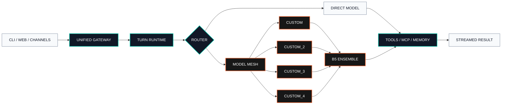

<p align="center">
  <strong><code>OPENSTARRY // CONTROL PLANE</code></strong>
</p>

<h1 align="center">OpenStarry Code</h1>

<p align="center">
  <strong>Stackable multi-provider intelligence for terminal, web, and messaging.</strong><br>
  One microkernel runtime. Four stackable API slots. Three custom protocols. Automatic model discovery.<br>
  <strong>面向终端、Web 与消息渠道的可叠加多模型智能运行时。本项目在opensquilla的基础上增加了自定义api支持</strong>
</p>

<p align="center">
  <a href="https://github.com/tomysh1337/openstarry-code/actions/workflows/ci.yml"></a>
  <a href="https://www.python.org/downloads/"></a>
  
  
  <a href="https://github.com/tomysh1337/openstarry-code/releases/latest"></a>
  <a href="LICENSE"></a>
</p>

<p align="center">
  <b>English</b> · <a href="README.zh-Hans.md">中文</a> · <a href="README.ja.md">日本語</a> · <a href="README.fr.md">Français</a> · <a href="README.de.md">Deutsch</a> · <a href="README.es.md">Español</a>
</p>

<p align="center">
  <a href="#signal-map">Signal Map</a> ·
  <a href="#architecture">Architecture</a> ·
  <a href="#quick-start">Quick Start</a> ·
  <a href="#release-build">Release</a> ·
  <a href="#custom-api-mesh">API Mesh</a> ·
  <a href="#command-deck">Command Deck</a> ·
  <a href="#documentation">Documentation</a>
</p>

---

> [!IMPORTANT]
> **OpenStarry Code** is maintained at
> [`tomysh1337/openstarry-code`](https://github.com/tomysh1337/openstarry-code).
> The distribution and CLI are named `openstarry-code`, the Python import and
> source package use `openstarry_code`, and new configuration lives under
> `openstarry-code.toml` or `~/.openstarry-code/`.

## 中文简介

OpenStarry Code 是一个支持终端、Web 控制台和消息渠道的微内核 AI Agent。
当前 fork 增加四个相互隔离的自定义 API 槽位、自动 `/models` 模型识别和可叠加的
B5 Ensemble，并统一使用 OpenStarry Code 的包、CLI、源码目录与配置路径。

完整中文安装、配置、构建、发布和 API 网格说明见
[`README.zh-Hans.md`](README.zh-Hans.md)。

## Signal Map

| Signal | State | What it controls |
| --- | :---: | --- |
| `CORE.01` | **ONLINE** | Shared turn runtime for Web UI, CLI, automation, and chat channels |
| `MESH.04` | **READY** | Four independent OpenAI-compatible custom API slots |
| `SCAN./MODELS` | **AUTO** | Endpoint model discovery with manual-ID fallback |
| `ROUTE.B5` | **ACTIVE** | Multi-model proposer and aggregator execution |
| `MEMORY.VEC` | **LOCAL** | Durable sessions, on-device embeddings, and vector retrieval |
| `TOOLS.MCP` | **NATIVE** | Lazy skills, MCP client tools, and MCP server mode |

OpenStarry Code keeps every interface on one execution path. Tool dispatch,
retry policy, session state, cost accounting, and model decisions behave the
same whether a turn starts in the control console, a terminal, or a messaging
channel.

## Architecture



### Runtime profile

```text
PROJECT      OPENSTARRY-CODE
RUNTIME      PYTHON 3.12+ / STARLETTE ASGI
CONTROL      VUE WEB CONSOLE / CLI / CHANNEL ADAPTERS
PROVIDERS    OPENAI / ANTHROPIC / OPENROUTER / OLLAMA / GEMINI / 20+
CUSTOM BUS   CUSTOM + CUSTOM_2 + CUSTOM_3 + CUSTOM_4
STRATEGY     DIRECT / ROUTER / ENSEMBLE
STATE        SQLITE + VECTOR MEMORY + DURABLE SESSIONS
```

## Core Capabilities

| Layer | Capability |
| --- | --- |
| **Provider fabric** | OpenAI, Anthropic, OpenRouter, Ollama, DeepSeek, Gemini, Qwen/DashScope, TokenRhythm, and 20+ provider profiles |
| **Custom API mesh** | Four isolated Chat Completions slots plus dedicated Responses and Anthropic Messages endpoints |
| **Model intelligence** | Automatic `/models` discovery, context metadata, local routing, and dynamic ensemble selection |
| **Agent runtime** | Persistent sessions, adaptive prompts, retries, structured tools, cron, and cost tracking |
| **Knowledge layer** | Local embeddings, vector memory, file ingestion, web search, and durable artifacts |
| **Interfaces** | Embedded Web UI, terminal chat, one-shot automation, WebSocket RPC, and desktop shell |
| **Channels** | Feishu, Telegram, DingTalk, QQ, WeCom, Slack, Discord, and optional Matrix |
| **Extension plane** | Bundled skills, installable skills, MCP client support, and `mcp-server` mode |

## Quick Start

OpenStarry-specific provider changes are available from this repository, so the
source development path is the recommended way to evaluate the fork.
Source builds require Python 3.12+, Node.js 22.12+ with npm, Git LFS, and `uv`.

### Requirements

| Component | Minimum |
| --- | --- |
| Python | 3.12+ |
| Node.js | 22.12+ with npm |
| Git | Git + Git LFS |
| Python environment | `uv` |

```sh
git lfs install
git clone https://github.com/tomysh1337/openstarry-code.git
cd openstarry-code
git lfs pull --include="src/openstarry_code/squilla_router/models/**"

cd openstarry-code-webui
npm ci
npm run build
cd ..

uv sync --extra recommended --extra dev
uv run openstarry-code onboard
uv run openstarry-code gateway run
```

Open the control console at
[`http://127.0.0.1:18791/control/`](http://127.0.0.1:18791/control/).
For terminal chat, run `uv run openstarry-code chat`.

<details>
<summary><strong>Platform bootstrap commands</strong></summary>

**Windows PowerShell**

```powershell
winget install --id Git.Git -e
winget install --id GitHub.GitLFS -e
winget install --id OpenJS.NodeJS.LTS -e
powershell -ExecutionPolicy Bypass -c "irm https://astral.sh/uv/install.ps1 | iex"
$env:Path = "$HOME\.local\bin;$env:Path"
git lfs install
```

**macOS**

```sh
brew install git git-lfs node uv
git lfs install
```

**Debian / Ubuntu**

```sh
sudo apt update && sudo apt install -y git git-lfs curl
curl -fsSL https://deb.nodesource.com/setup_22.x | sudo -E bash -
sudo apt install -y nodejs
curl -LsSf https://astral.sh/uv/install.sh | sh
. "$HOME/.local/bin/env"
git lfs install
```

</details>

<details>
<summary><strong>Install as a user tool</strong></summary>

The source installer builds the Vue console and installs the runtime into an
isolated user environment.

```sh
bash scripts/install_source.sh
```

```powershell
powershell -ExecutionPolicy Bypass -File ./scripts/install_source.ps1
```

After this installation mode, run `openstarry-code` directly instead of
`uv run openstarry-code`.

The OpenStarry Code release channel publishes the verified Python wheel and
source distribution. Desktop installers are published separately after their
bundled gateway and platform runtime pass the packaging gate.

</details>

## Release Build

The current OpenStarry Code release is
[`v0.5.6`](https://github.com/tomysh1337/openstarry-code/releases/tag/v0.5.6),
built from the tagged repository state on 2026-08-15.

Install its verified wheel directly with `uv`:

```sh
uv tool install --python 3.12 \
  "openstarry-code[recommended] @ https://github.com/tomysh1337/openstarry-code/releases/download/v0.5.6/openstarry_code-0.5.6-py3-none-any.whl"
```
<!-- release URL boundary: / -->

| Artifact | Purpose | Integrity |
| --- | --- | --- |
| [`OpenStarry-Code-0.5.6-win-x64.exe`](https://github.com/tomysh1337/openstarry-code/releases/download/v0.5.6/OpenStarry-Code-0.5.6-win-x64.exe) | Interactive NSIS Windows installer | Listed in `SHA256SUMS` |
| [`OpenStarry-Code-0.5.6-win-x64.msi`](https://github.com/tomysh1337/openstarry-code/releases/download/v0.5.6/OpenStarry-Code-0.5.6-win-x64.msi) | WiX MSI Windows installer | Listed in `SHA256SUMS` |
| [`openstarry_code-0.5.6-py3-none-any.whl`](https://github.com/tomysh1337/openstarry-code/releases/download/v0.5.6/openstarry_code-0.5.6-py3-none-any.whl) | Installable Python runtime with the compiled Web UI | Listed in `SHA256SUMS` |
| [`openstarry_code-0.5.6.tar.gz`](https://github.com/tomysh1337/openstarry-code/releases/download/v0.5.6/openstarry_code-0.5.6.tar.gz) | Reproducible source distribution | Listed in `SHA256SUMS` |
| `SHA256SUMS` | SHA-256 manifest for release downloads | Published with the release |

Release verification covers the complete frontend build, artifact contract,
Python package build, focused provider/configuration tests, Web UI unit tests,
and dependency audit. The Windows desktop release includes the bundled gateway,
Python, Node.js, and Git Bash runtimes in both NSIS EXE and WiX MSI formats.
Windows installers are currently unsigned; verify `SHA256SUMS` before use.

| Release gate | Result |
| --- | --- |
| Web architecture, theme, motion, security, and locale guards | Passed |
| Vue TypeScript validation | Passed |
| Web UI unit suite | 3,755 tests passed |
| Python focused suite | 698 passed, 3 skipped |
| npm dependency audit | 0 known vulnerabilities |
| Wheel/sdist build | Passed |

See [`CHANGELOG.md`](CHANGELOG.md) for the version history and
[`docs/releases/0.5.6.md`](docs/releases/0.5.6.md) for detailed release notes.

## Codex-X Companion

Windows EXE and MSI packages include
[Codex-X `v0.3.12`](https://github.com/yynxxxxx/Codex-X) as a verified portable
companion. Open it from the Skills toolbar to manage Codex prompt templates,
conversation indexes, Skills, and MCP configuration.

- The build downloads one pinned portable archive and verifies SHA-256
  `3641a3cc4434fd8bf237108ccb7177c231606639b4990b32630faccee403978f`.
- Codex-X receives the same `${CODEX_HOME:-~/.codex}` used by OpenStarry Code;
  prompts, conversations, Skills, and MCP configuration therefore stay on one
  shared Codex data source.
- OpenStarry Code reads `${CODEX_HOME:-~/.codex}/skills` as the dedicated
  `codex` Skill layer. Changes become available after catalog reload without
  copying the personal Skill tree into the repository.
- Codex-X's separate application database remains under the OpenStarry desktop
  profile through `CODEXX_HOME`. Microsoft Edge WebView2 Runtime is required.

The desktop package includes the upstream MIT license next to `Codex-X.exe`.
The model-facing `sandbox_status` tool separately reports the current sandbox
backend, setup/capability state, and effective file/network posture without
starting a command.

### Network privacy

Disable non-user-initiated network observability with:

```sh
OPENSTARRY_CODE_PRIVACY_DISABLE_NETWORK_OBSERVABILITY=true
```

or:

```toml
[privacy]
disable_network_observability = true
```

`OPENSTARRY_CODE_TELEMETRY_DISABLED=true` and
`OPENSTARRY_CODE_UPDATE_CHECK_DISABLED=true` apply the same unified opt-out to
installation telemetry and passive update checks. Legacy aliases remain
available to the profile migration layer.
Explicit update-availability checks remain disabled when these controls apply. See
[`PRIVACY.md`](PRIVACY.md) and
[`THIRD_PARTY_NOTICES.md`](THIRD_PARTY_NOTICES.md).

## Custom API Mesh

Each custom endpoint is a first-class provider with independent connection
state. The setup catalog keeps these endpoints in a dedicated **Third-party
APIs** group and labels every entry with its wire protocol, so a compatible
endpoint can be selected without guessing its request format.

| Provider ID | Default key variable | Isolation |
| --- | --- | --- |
| `custom` | `CUSTOM_LLM_API_KEY` | Base URL, key, model, proxy |
| `custom_2` | `CUSTOM_LLM_2_API_KEY` | Base URL, key, model, proxy |
| `custom_3` | `CUSTOM_LLM_3_API_KEY` | Base URL, key, model, proxy |
| `custom_4` | `CUSTOM_LLM_4_API_KEY` | Base URL, key, model, proxy |
| `custom_responses` | `CUSTOM_RESPONSES_API_KEY` | OpenAI Responses protocol, Base URL, optional key, model |
| `custom_anthropic` | `CUSTOM_ANTHROPIC_API_KEY` | Anthropic Messages protocol, Base URL, optional key, model |

After a successful connection probe, each slot requests
`GET <base_url>/models`. Returned model IDs populate the model picker. An
endpoint without a model catalog remains usable through the manual model-ID
field.

### Custom request headers and profile duplication

The setup panel accepts named request headers for gateways that require tenant,
project, routing, or vendor-specific metadata. The same headers are used by
connection probes, model discovery, normal turns, Router/Ensemble candidates,
automatic session naming, and context compaction. Header values are redacted
from public configuration, RPC responses, object representations, and LLM
traces.

Header names must be unique without regard to case. Authentication and HTTP
framing headers are reserved, and CR, LF, or NUL characters are rejected.
Masked values can be retained while editing the same origin; changing the Base
URL to a different origin clears the old headers so credentials are not sent to
another host.

Any Chat Completions profile can be duplicated atomically into the next empty
custom slot. The server copies its Base URL, model, proxy, credential reference,
and custom headers without returning secret values to the browser.

## Web Search Matrix

OpenStarry Code includes four search paths that need no API key: DuckDuckGo,
Bing China (`bing_cn`), Baidu (`baidu`), and Sogou (`sogou`). Bocha, Brave,
Alibaba Cloud IQS, Tavily, and Exa remain available as keyed providers. Every
provider returns the same normalized title, URL, snippet, and source shape, so
the selected engine can be changed without changing agent tools.

```sh
openstarry-code configure search --search-provider bing_cn
openstarry-code configure search --search-provider baidu
openstarry-code configure search --search-provider sogou
```

See [`docs/search.md`](docs/search.md) for fallback, proxy, diagnostics, and
provider-selection behavior.

### Stack multiple APIs

```toml
[llm]
provider = "custom"
model = "model-a"
base_url = "https://api-a.example/v1"

[llm_profiles.custom_2]
model = "model-b"
base_url = "https://api-b.example/v1"

[llm_profiles.custom_3]
model = "model-c"
base_url = "https://api-c.example/v1"

[llm_profiles.custom_4]
model = "model-d"
base_url = "https://api-d.example/v1"
```

Keys can remain outside the configuration file:

```sh
export CUSTOM_LLM_API_KEY="TOKEN_A"
export CUSTOM_LLM_2_API_KEY="TOKEN_B"
export CUSTOM_LLM_3_API_KEY="TOKEN_C"
export CUSTOM_LLM_4_API_KEY="TOKEN_D"
```

### Compose a B5 ensemble

```toml
[llm_ensemble]
enabled = true
selection_mode = "custom_b5"
min_successful_proposers = 2

[[llm_ensemble.candidates]]
provider = "custom"
model = "model-a"
role = "primary"

[[llm_ensemble.candidates]]
provider = "custom_2"
model = "model-b"
role = "contrast"

[[llm_ensemble.candidates]]
provider = "custom_3"
model = "model-c"
role = "reviewer"

[[llm_ensemble.candidates]]
provider = "custom_4"
model = "model-d"
role = "aggregator"
```

The runtime executes proposer calls independently, applies quorum and timeout
rules, then sends accepted outputs to the aggregator. See
[`docs/providers-and-models.md`](docs/providers-and-models.md) and
[`docs/features/LLM-ensemble-design.md`](docs/features/LLM-ensemble-design.md)
for model metadata and selection details.

## Command Deck

Commands below assume a user-tool installation. Prefix them with `uv run` in a
development checkout.

```sh
openstarry-code onboard                         # interactive setup
openstarry-code onboard status                  # setup diagnostics
openstarry-code gateway run                     # foreground gateway
openstarry-code gateway start --json            # managed background gateway
openstarry-code gateway status                  # runtime status
openstarry-code chat                            # terminal conversation
openstarry-code agent -m "your prompt"           # one-shot automation
openstarry-code doctor --json                   # full readiness report
openstarry-code models list                     # model catalog
openstarry-code providers list                  # provider catalog
openstarry-code mcp-server run                  # expose MCP server mode
```

Configuration resolution order:

```text
OPENSTARRY_CODE_GATEWAY_CONFIG_PATH
  -> ./openstarry-code.toml
  -> ~/.openstarry-code/config.toml
  -> built-in defaults
```

## Repository Matrix

| Path | Responsibility |
| --- | --- |
| `src/openstarry_code/` | Python runtime, providers, gateway, memory, channels, tools |
| `openstarry-code-webui/` | Vue control console and browser tests |
| `desktop/electron/` | Desktop shell and packaging |
| `docs/` | Operations, providers, architecture, and feature contracts |
| `tests/` | Unit, integration, functional, and compatibility coverage |
| `scripts/` | Source installers, release checks, and maintenance utilities |

## Verification

```sh
uv run ruff check src tests
uv run mypy src/openstarry_code --show-error-codes
uv run pytest -q

cd openstarry-code-webui
npm run typecheck
npm run test:unit
```

## Documentation

| Start here | Reference |
| --- | --- |
| Install and first run | [`docs/quickstart.md`](docs/quickstart.md) |
| Provider and model setup | [`docs/providers-and-models.md`](docs/providers-and-models.md) |
| Configuration schema | [`docs/configuration.md`](docs/configuration.md) |
| Gateway operations | [`docs/gateway.md`](docs/gateway.md) |
| CLI reference | [`docs/cli.md`](docs/cli.md) |
| Web control console | [`docs/web-ui.md`](docs/web-ui.md) |
| Channels | [`docs/channels.md`](docs/channels.md) |
| Tools and sandbox | [`docs/tools-and-sandbox.md`](docs/tools-and-sandbox.md) |
| Product guide | [`README.product.md`](README.product.md) |

## Naming and Compatibility

| Surface | Name |
| --- | --- |
| Repository | `openstarry-code` |
| Product | **OpenStarry Code** |
| Python distribution | `openstarry-code` |
| Python import | `openstarry_code` |
| CLI executable | `openstarry-code` |
| Default config | `openstarry-code.toml` / `~/.openstarry-code/config.toml` |

Python identifiers use an underscore because imports cannot contain a hyphen.
Repository, distribution, CLI, Web UI directory, configuration file, and state
directory otherwise use the `openstarry-code` name.

## License and Lineage

Licensed under [Apache License 2.0](LICENSE).

OpenStarry Code is derived from the
[upstream project](https://github.com/opensquilla/opensquilla). Upstream release
artifacts, notices, and contributor history remain credited in their original
locations.

<p align="center">
  <strong><code>OPENSTARRY // BUILD THE MODEL MESH</code></strong>
</p>
