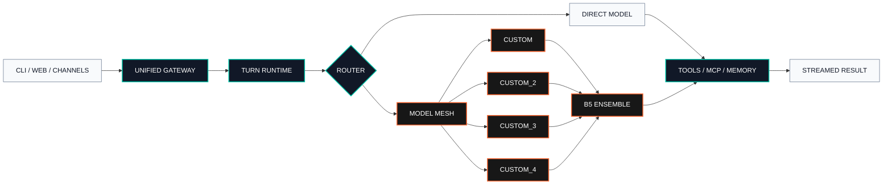

<p align="center">
  <strong><code>OPENSTARRY // CONTROL PLANE</code></strong>
</p>

<h1 align="center">OpenStarry Code</h1>

<p align="center">
  <strong>Stackable multi-provider intelligence for terminal, web, and messaging.</strong><br>
  One microkernel runtime. Four custom API slots. Automatic model discovery. One composable model mesh.
</p>

<p align="center">
  <a href="https://github.com/tomysh1337/openstarry-code/actions/workflows/ci.yml"></a>
  <a href="https://www.python.org/downloads/"></a>
  
  
  <a href="LICENSE"></a>
</p>

<p align="center">
  <b>English</b> · <a href="README.zh-Hans.md">中文</a> · <a href="README.ja.md">日本語</a> · <a href="README.fr.md">Français</a> · <a href="README.de.md">Deutsch</a> · <a href="README.es.md">Español</a>
</p>

<p align="center">
  <a href="#signal-map">Signal Map</a> ·
  <a href="#architecture">Architecture</a> ·
  <a href="#quick-start">Quick Start</a> ·
  <a href="#custom-api-mesh">API Mesh</a> ·
  <a href="#command-deck">Command Deck</a> ·
  <a href="#documentation">Documentation</a>
</p>

---

> [!IMPORTANT]
> **OpenStarry Code** is maintained at
> [`tomysh1337/openstarry-code`](https://github.com/tomysh1337/openstarry-code).
> The Python package, import path, CLI, configuration files, and
> `OPENSQUILLA_*` environment variables retain their compatibility names.

## Signal Map

| Signal | State | What it controls |
| --- | :---: | --- |
| `CORE.01` | **ONLINE** | Shared turn runtime for Web UI, CLI, automation, and chat channels |
| `MESH.04` | **READY** | Four independent OpenAI-compatible custom API slots |
| `SCAN./MODELS` | **AUTO** | Endpoint model discovery with manual-ID fallback |
| `ROUTE.B5` | **ACTIVE** | Multi-model proposer and aggregator execution |
| `MEMORY.VEC` | **LOCAL** | Durable sessions, on-device embeddings, and vector retrieval |
| `TOOLS.MCP` | **NATIVE** | Lazy skills, MCP client tools, and MCP server mode |

OpenStarry Code keeps every interface on one execution path. Tool dispatch,
retry policy, session state, cost accounting, and model decisions behave the
same whether a turn starts in the control console, a terminal, or a messaging
channel.

## Architecture



### Runtime profile

```text
PROJECT      OPENSTARRY-CODE
RUNTIME      PYTHON 3.12+ / STARLETTE ASGI
CONTROL      VUE WEB CONSOLE / CLI / CHANNEL ADAPTERS
PROVIDERS    OPENAI / ANTHROPIC / OPENROUTER / OLLAMA / GEMINI / 20+
CUSTOM BUS   CUSTOM + CUSTOM_2 + CUSTOM_3 + CUSTOM_4
STRATEGY     DIRECT / ROUTER / ENSEMBLE
STATE        SQLITE + VECTOR MEMORY + DURABLE SESSIONS
```

## Core Capabilities

| Layer | Capability |
| --- | --- |
| **Provider fabric** | OpenAI, Anthropic, OpenRouter, Ollama, DeepSeek, Gemini, Qwen/DashScope, TokenRhythm, and 20+ provider profiles |
| **Custom API mesh** | Four isolated base URLs, keys, default models, proxies, and model catalogs |
| **Model intelligence** | Automatic `/models` discovery, context metadata, local routing, and dynamic ensemble selection |
| **Agent runtime** | Persistent sessions, adaptive prompts, retries, structured tools, cron, and cost tracking |
| **Knowledge layer** | Local embeddings, vector memory, file ingestion, web search, and durable artifacts |
| **Interfaces** | Embedded Web UI, terminal chat, one-shot automation, WebSocket RPC, and desktop shell |
| **Channels** | Feishu, Telegram, DingTalk, QQ, WeCom, Slack, Discord, and optional Matrix |
| **Extension plane** | Bundled skills, installable skills, MCP client support, and `mcp-server` mode |

## Quick Start

OpenStarry-specific provider changes are available from this repository, so the
source development path is the recommended way to evaluate the fork.
Source builds require Python 3.12+, Node.js 22.12+ with npm, Git LFS, and `uv`.

### Requirements

| Component | Minimum |
| --- | --- |
| Python | 3.12+ |
| Node.js | 22.12+ with npm |
| Git | Git + Git LFS |
| Python environment | `uv` |

```sh
git lfs install
git clone https://github.com/tomysh1337/openstarry-code.git
cd openstarry-code
git lfs pull --include="src/opensquilla/squilla_router/models/**"

cd opensquilla-webui
npm ci
npm run build
cd ..

uv sync --extra recommended --extra dev
uv run opensquilla onboard
uv run opensquilla gateway run
```

Open the control console at
[`http://127.0.0.1:18791/control/`](http://127.0.0.1:18791/control/).
For terminal chat, run `uv run opensquilla chat`.

<details>
<summary><strong>Platform bootstrap commands</strong></summary>

**Windows PowerShell**

```powershell
winget install --id Git.Git -e
winget install --id GitHub.GitLFS -e
winget install --id OpenJS.NodeJS.LTS -e
powershell -ExecutionPolicy Bypass -c "irm https://astral.sh/uv/install.ps1 | iex"
git lfs install
```

**macOS**

```sh
brew install git git-lfs node uv
git lfs install
```

**Debian / Ubuntu**

```sh
sudo apt update && sudo apt install -y git git-lfs curl
curl -fsSL https://deb.nodesource.com/setup_22.x | sudo -E bash -
sudo apt install -y nodejs
curl -LsSf https://astral.sh/uv/install.sh | sh
git lfs install
```

</details>

<details>
<summary><strong>Install as a user tool</strong></summary>

The source installer builds the Vue console and installs the runtime into an
isolated user environment.

```sh
bash scripts/install_source.sh
```

```powershell
powershell -ExecutionPolicy Bypass -File ./scripts/install_source.ps1
```

After this installation mode, run `opensquilla` directly instead of
`uv run opensquilla`.

Published desktop packages and wheels currently come from the
[upstream release channel](https://github.com/opensquilla/opensquilla/releases).
Use the source workflow above when you need this fork's custom API additions.

</details>

## Custom API Mesh

Each OpenAI-compatible slot is a first-class provider with independent
connection state.

| Provider ID | Default key variable | Isolation |
| --- | --- | --- |
| `custom` | `CUSTOM_LLM_API_KEY` | Base URL, key, model, proxy |
| `custom_2` | `CUSTOM_LLM_2_API_KEY` | Base URL, key, model, proxy |
| `custom_3` | `CUSTOM_LLM_3_API_KEY` | Base URL, key, model, proxy |
| `custom_4` | `CUSTOM_LLM_4_API_KEY` | Base URL, key, model, proxy |

After a successful connection probe, each slot requests
`GET <base_url>/models`. Returned model IDs populate the model picker. An
endpoint without a model catalog remains usable through the manual model-ID
field.

### Stack multiple APIs

```toml
[llm]
provider = "custom"
model = "model-a"
base_url = "https://api-a.example/v1"

[llm_profiles.custom_2]
model = "model-b"
base_url = "https://api-b.example/v1"

[llm_profiles.custom_3]
model = "model-c"
base_url = "https://api-c.example/v1"

[llm_profiles.custom_4]
model = "model-d"
base_url = "https://api-d.example/v1"
```

Keys can remain outside the configuration file:

```sh
export CUSTOM_LLM_API_KEY="TOKEN_A"
export CUSTOM_LLM_2_API_KEY="TOKEN_B"
export CUSTOM_LLM_3_API_KEY="TOKEN_C"
export CUSTOM_LLM_4_API_KEY="TOKEN_D"
```

### Compose a B5 ensemble

```toml
[llm_ensemble]
enabled = true
selection_mode = "custom_b5"
min_successful_proposers = 2

[[llm_ensemble.candidates]]
provider = "custom"
model = "model-a"
role = "primary"

[[llm_ensemble.candidates]]
provider = "custom_2"
model = "model-b"
role = "contrast"

[[llm_ensemble.candidates]]
provider = "custom_3"
model = "model-c"
role = "reviewer"

[[llm_ensemble.candidates]]
provider = "custom_4"
model = "model-d"
role = "aggregator"
```

The runtime executes proposer calls independently, applies quorum and timeout
rules, then sends accepted outputs to the aggregator. See
[`docs/providers-and-models.md`](docs/providers-and-models.md) and
[`docs/features/LLM-ensemble-design.md`](docs/features/LLM-ensemble-design.md)
for model metadata and selection details.

## Command Deck

Commands below assume a user-tool installation. Prefix them with `uv run` in a
development checkout.

```sh
opensquilla onboard                         # interactive setup
opensquilla onboard status                  # setup diagnostics
opensquilla gateway run                     # foreground gateway
opensquilla gateway start --json            # managed background gateway
opensquilla gateway status                  # runtime status
opensquilla chat                            # terminal conversation
opensquilla agent -m "your prompt"           # one-shot automation
opensquilla doctor --json                   # full readiness report
opensquilla models list                     # model catalog
opensquilla providers list                  # provider catalog
opensquilla mcp-server run                  # expose MCP server mode
```

Configuration resolution order:

```text
OPENSQUILLA_GATEWAY_CONFIG_PATH
  -> ./opensquilla.toml
  -> ~/.opensquilla/config.toml
  -> built-in defaults
```

## Repository Matrix

| Path | Responsibility |
| --- | --- |
| `src/opensquilla/` | Python runtime, providers, gateway, memory, channels, tools |
| `opensquilla-webui/` | Vue control console and browser tests |
| `desktop/electron/` | Desktop shell and packaging |
| `docs/` | Operations, providers, architecture, and feature contracts |
| `tests/` | Unit, integration, functional, and compatibility coverage |
| `scripts/` | Source installers, release checks, and maintenance utilities |

## Verification

```sh
uv run ruff check src tests
uv run mypy src/opensquilla --show-error-codes
uv run pytest -q

cd opensquilla-webui
npm run typecheck
npm run test:unit
```

## Documentation

| Start here | Reference |
| --- | --- |
| Install and first run | [`docs/quickstart.md`](docs/quickstart.md) |
| Provider and model setup | [`docs/providers-and-models.md`](docs/providers-and-models.md) |
| Configuration schema | [`docs/configuration.md`](docs/configuration.md) |
| Gateway operations | [`docs/gateway.md`](docs/gateway.md) |
| CLI reference | [`docs/cli.md`](docs/cli.md) |
| Web control console | [`docs/web-ui.md`](docs/web-ui.md) |
| Channels | [`docs/channels.md`](docs/channels.md) |
| Tools and sandbox | [`docs/tools-and-sandbox.md`](docs/tools-and-sandbox.md) |
| Product guide | [`README.product.md`](README.product.md) |

## Naming and Compatibility

| Surface | Name |
| --- | --- |
| Repository | `openstarry-code` |
| Product | **OpenStarry Code** |
| Python distribution | `opensquilla` |
| Python import | `opensquilla` |
| CLI executable | `opensquilla` |
| Default config | `opensquilla.toml` / `~/.opensquilla/config.toml` |

These compatibility names are deliberate: existing environments, scripts, and
plugins continue to work while the repository and product identity move to
OpenStarry Code.

## License and Lineage

Licensed under [Apache License 2.0](LICENSE).

OpenStarry Code is derived from the
[upstream project](https://github.com/opensquilla/opensquilla). Upstream release
artifacts, notices, and contributor history remain credited in their original
locations.

<p align="center">
  <strong><code>OPENSTARRY // BUILD THE MODEL MESH</code></strong>
</p>
