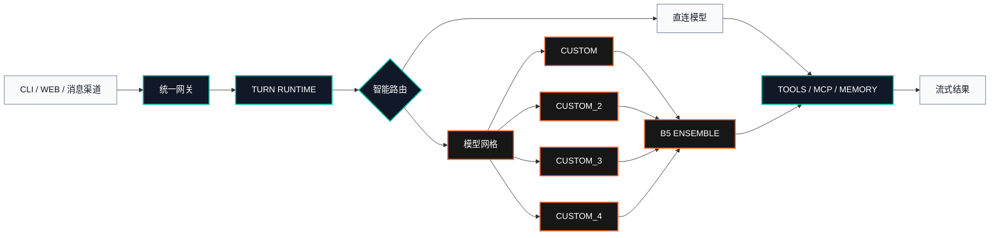

<!-- 本文件与 README.md 的 OpenStarry Code 品牌及核心流程保持同步。 -->

<p align="center">
  <strong><code>OPENSTARRY // CONTROL PLANE</code></strong>
</p>

<h1 align="center">OpenStarry Code</h1>

<p align="center">
  <strong>面向终端、Web 与消息渠道的可叠加多模型智能运行时。</strong><br>
  一个微内核，四个可叠加 API 槽位，三种自定义协议，自动识别模型。
</p>

<p align="center">
  <a href="https://github.com/tomysh1337/openstarry-code/actions/workflows/ci.yml"></a>
  <a href="https://www.python.org/downloads/"></a>
  
  
  <a href="https://github.com/tomysh1337/openstarry-code/releases/latest"></a>
  <a href="LICENSE"></a>
</p>

<p align="center">
  <a href="README.md">English</a> · <b>中文</b> · <a href="README.ja.md">日本語</a> · <a href="README.fr.md">Français</a> · <a href="README.de.md">Deutsch</a> · <a href="README.es.md">Español</a>
</p>

<p align="center">
  <a href="#系统信号">系统信号</a> ·
  <a href="#运行架构">运行架构</a> ·
  <a href="#快速启动">快速启动</a> ·
  <a href="#发布构建">发布构建</a> ·
  <a href="#自定义-api-网格">API 网格</a> ·
  <a href="#命令面板">命令面板</a> ·
  <a href="#文档导航">文档导航</a>
</p>

---

> [!IMPORTANT]
> **OpenStarry Code** 的维护仓库为
> [`tomysh1337/openstarry-code`](https://github.com/tomysh1337/openstarry-code)。
> Python 发行包与 CLI 使用 `openstarry-code`，Python 导入路径与源码包目录使用
> `openstarry_code`，新配置位于 `openstarry-code.toml` 或
> `~/.openstarry-code/`。

## 系统信号

| 信号 | 状态 | 控制范围 |
| --- | :---: | --- |
| `CORE.01` | **ONLINE** | Web UI、CLI、自动化与消息渠道共用的 Turn Runtime |
| `MESH.04` | **READY** | 四个相互独立的 OpenAI 兼容自定义 API 槽位 |
| `SCAN./MODELS` | **AUTO** | 自动识别端点模型，保留手动模型 ID 回退 |
| `ROUTE.B5` | **ACTIVE** | 多模型提议、审查与聚合执行 |
| `MEMORY.VEC` | **LOCAL** | 持久会话、本地嵌入与向量检索 |
| `TOOLS.MCP` | **NATIVE** | 按需技能、MCP 客户端工具及 MCP 服务端模式 |

OpenStarry Code 让所有入口使用同一条执行链。无论任务来自控制台、终端还是消息渠道，
工具调度、重试策略、会话状态、成本统计和模型决策均保持一致。

## 运行架构



### 运行时档案

```text
PROJECT      OPENSTARRY-CODE
RUNTIME      PYTHON 3.12+ / STARLETTE ASGI
CONTROL      VUE WEB CONSOLE / CLI / CHANNEL ADAPTERS
PROVIDERS    OPENAI / ANTHROPIC / OPENROUTER / OLLAMA / GEMINI / 20+
CUSTOM BUS   CUSTOM + CUSTOM_2 + CUSTOM_3 + CUSTOM_4
STRATEGY     DIRECT / ROUTER / ENSEMBLE
STATE        SQLITE + VECTOR MEMORY + DURABLE SESSIONS
```

## 核心能力

| 层级 | 能力 |
| --- | --- |
| **提供商总线** | OpenAI、Anthropic、OpenRouter、Ollama、DeepSeek、Gemini、Qwen/DashScope、TokenRhythm 等 20 多个提供商档案 |
| **自定义 API 网格** | 四套独立 Chat Completions 槽位，以及专用 Responses 与 Anthropic Messages 入口 |
| **模型智能** | 自动请求 `/models`、上下文元数据、本地路由和动态 Ensemble 选择 |
| **Agent 运行时** | 持久会话、自适应提示、重试、结构化工具、定时任务和成本统计 |
| **知识层** | 本地嵌入、向量记忆、文件处理、网络搜索和持久化产物 |
| **交互入口** | 内嵌 Web UI、终端聊天、单次自动化、WebSocket RPC 和桌面壳 |
| **消息渠道** | 飞书、Telegram、钉钉、QQ、企业微信、Slack、Discord 及可选 Matrix |
| **扩展平面** | 内置技能、可安装技能、MCP 客户端以及 `mcp-server` 模式 |

## 快速启动

OpenStarry Code 的 API 叠加与模型识别功能位于当前仓库，因此推荐从源码开发模式启动。
源码构建需要 Python 3.12+、Node.js 22.12+（含 npm）、Git LFS 和 `uv`。

### 环境要求

| 组件 | 最低版本 |
| --- | --- |
| Python | 3.12+ |
| Node.js | 22.12+，包含 npm |
| Git | Git + Git LFS |
| Python 环境 | `uv` |

```sh
git lfs install
git clone https://github.com/tomysh1337/openstarry-code.git
cd openstarry-code
git lfs pull --include="src/openstarry_code/squilla_router/models/**"

cd openstarry-code-webui
npm ci
npm run build
cd ..

uv sync --extra recommended --extra dev
uv run openstarry-code onboard
uv run openstarry-code gateway run
```

控制台地址：
[`http://127.0.0.1:18791/control/`](http://127.0.0.1:18791/control/)。
启动终端聊天：`uv run openstarry-code chat`。

<details>
<summary><strong>各平台环境安装命令</strong></summary>

**Windows PowerShell**

```powershell
winget install --id Git.Git -e
winget install --id GitHub.GitLFS -e
winget install --id OpenJS.NodeJS.LTS -e
powershell -ExecutionPolicy Bypass -c "irm https://astral.sh/uv/install.ps1 | iex"
git lfs install
```

**macOS**

```sh
brew install git git-lfs node uv
git lfs install
```

**Debian / Ubuntu**

```sh
sudo apt update && sudo apt install -y git git-lfs curl
curl -fsSL https://deb.nodesource.com/setup_22.x | sudo -E bash -
sudo apt install -y nodejs
curl -LsSf https://astral.sh/uv/install.sh | sh
git lfs install
```

</details>

<details>
<summary><strong>安装为用户级工具</strong></summary>

源码安装器会先构建 Vue 控制台，再把运行时装进独立的用户环境。

```sh
bash scripts/install_source.sh
```

```powershell
powershell -ExecutionPolicy Bypass -File ./scripts/install_source.ps1
```

使用这种方式安装后，直接运行 `openstarry-code`，无需添加 `uv run` 前缀。

当前发布的桌面安装包、MSI、wheel 和源码包均来自
[OpenStarry Code Release](https://github.com/tomysh1337/openstarry-code/releases)。
源码流程适合本地开发，Release 产物适合直接安装和版本化部署。

</details>

## 发布构建

当前 OpenStarry Code 正式版本为
[`v0.5.9`](https://github.com/tomysh1337/openstarry-code/releases/tag/v0.5.9)，
由 2026-08-17 的仓库标签状态构建。

使用 `uv` 直接安装已验证的 wheel：

```sh
uv tool install --python 3.12 \
  "openstarry-code[recommended] @ https://github.com/tomysh1337/openstarry-code/releases/download/v0.5.9/openstarry_code-0.5.9-py3-none-any.whl"
```
<!-- Release URL 分隔：/ -->

| 产物 | 用途 | 完整性 |
| --- | --- | --- |
| [`OpenStarry-Code-0.5.9-win-x64.exe`](https://github.com/tomysh1337/openstarry-code/releases/download/v0.5.9/OpenStarry-Code-0.5.9-win-x64.exe) | NSIS Windows 交互式安装包 | 记录于 `SHA256SUMS` |
| [`OpenStarry-Code-0.5.9-win-x64.msi`](https://github.com/tomysh1337/openstarry-code/releases/download/v0.5.9/OpenStarry-Code-0.5.9-win-x64.msi) | WiX MSI Windows 安装包 | 记录于 `SHA256SUMS` |
| [`openstarry_code-0.5.9-py3-none-any.whl`](https://github.com/tomysh1337/openstarry-code/releases/download/v0.5.9/openstarry_code-0.5.9-py3-none-any.whl) | 包含已编译 Web UI 的 Python 运行时 | 记录于 `SHA256SUMS` |
| [`openstarry_code-0.5.9.tar.gz`](https://github.com/tomysh1337/openstarry-code/releases/download/v0.5.9/openstarry_code-0.5.9.tar.gz) | 可复现的源码发行包 | 记录于 `SHA256SUMS` |
| `SHA256SUMS` | Release 下载文件的 SHA-256 清单 | 与版本同步发布 |

发布验证覆盖完整前端构建、产物契约、Python 包构建、提供商与配置专项测试、Web UI
单元测试和依赖审计。Windows 桌面安装包内置 Python gateway、Node.js、Python 和
Git Bash runtime，同时提供 NSIS EXE 与 WiX MSI。当前 Windows 安装包尚未代码签名，
使用前请核对 `SHA256SUMS`。

| 发布门禁 | 结果 |
| --- | --- |
| Web 架构、主题、动画、安全和多语言守卫 | 通过 |
| Vue TypeScript 校验 | 通过 |
| Web UI 单元测试 | 3,755 项通过 |
| Python 专项测试 | 698 项通过，3 项跳过 |
| npm 依赖审计 | 0 个已知漏洞 |
| wheel/sdist 构建 | 通过 |
| Windows EXE/MSI 构建与包结构校验 | 通过 |

版本历史见 [`CHANGELOG.md`](CHANGELOG.md)，详细发行说明见
[`docs/releases/0.5.9.md`](docs/releases/0.5.9.md)。

## Codex-X 伴生工具

Windows EXE 与 MSI 安装包内置经过校验的
[Codex-X `v0.3.12`](https://github.com/yynxxxxx/Codex-X) portable 版本。可从
“技能”页工具栏直接打开，用于管理 Codex 提示词模板、对话索引、Skills 与 MCP 配置。

- 构建过程只下载固定版本压缩包，并校验 SHA-256
  `3641a3cc4434fd8bf237108ccb7177c231606639b4990b32630faccee403978f`。
- Codex-X 与 OpenStarry Code 使用相同的 `${CODEX_HOME:-~/.codex}`，提示词、
  对话、Skills 与 MCP 配置以同一个 Codex 数据目录为准。
- OpenStarry Code 将 `${CODEX_HOME:-~/.codex}/skills` 作为独立 `codex`
  技能层直接加载；目录重新加载后即可看到变更，不在仓库中复制个人技能树。
- Codex-X 自身的应用数据库通过 `CODEXX_HOME` 留在 OpenStarry 桌面 profile
  中。该伴生应用依赖 Microsoft Edge WebView2 Runtime。

桌面包会把上游 MIT 许可证放在 `Codex-X.exe` 旁边。模型侧新增只读
`sandbox_status` 工具，可查看当前沙箱 backend、setup/capability 状态和有效的
文件/网络策略，不会启动命令。

### 上游兼容下载

OpenStarry Code v0.5.9 已提供独立 Windows 安装包。需要核对上游 0.5.3 行为时，
对应的固定版本 GitHub 产物为：

- [`OpenSquilla-0.5.3-mac-arm64.dmg`](https://github.com/opensquilla/opensquilla/releases/download/v0.5.3/OpenSquilla-0.5.3-mac-arm64.dmg)
- [`OpenSquilla-0.5.3-win-x64.exe`](https://github.com/opensquilla/opensquilla/releases/download/v0.5.3/OpenSquilla-0.5.3-win-x64.exe)

Alibaba Cloud OSS 镜像提供滚动桌面下载地址：

- <https://opensquilla-releases.oss-cn-beijing.aliyuncs.com/releases/latest/OpenSquilla-mac-arm64.dmg>
- <https://opensquilla-releases.oss-cn-beijing.aliyuncs.com/releases/latest/OpenSquilla-win-x64.exe>

继承容器镜像为 `ghcr.io/opensquilla/opensquilla:latest`。Portable 压缩包继续保持退役，
桌面 zip 属于更新器产物，并非独立便携版本。Release 安装命令使用已经发布的 GitHub
固定版本资源，Python wheel 也使用带版本号的文件名，以便安装器校验包版本。

Windows 构建当前没有代码签名，使用前请阅读
[`docs/code-signing-policy.md`](docs/code-signing-policy.md)并检查平台信任提示。

从继承的 Windows RC3 桌面端升级时，必须先备份 `%APPDATA%\OpenSquilla`，再将 RC4
或更高版本直接覆盖安装；不要先卸载 RC3，因为旧卸载器可能删除应用数据目录。

### 网络隐私

通过以下环境变量关闭非用户主动触发的网络可观测行为：

```sh
OPENSTARRY_CODE_PRIVACY_DISABLE_NETWORK_OBSERVABILITY=true
```

或使用配置：

```toml
[privacy]
disable_network_observability = true
```

`OPENSTARRY_CODE_TELEMETRY_DISABLED=true` 和
`OPENSTARRY_CODE_UPDATE_CHECK_DISABLED=true` 会关闭安装遥测与被动更新检查。用户显式触发的更新可用性检查也不会绕过它
所代表的统一或兼容关闭设置。详情见 [`PRIVACY.md`](PRIVACY.md)和
[`THIRD_PARTY_NOTICES.md`](THIRD_PARTY_NOTICES.md)。

## 自定义 API 网格

每个自定义端点都是独立的一等提供商。设置目录将这些端点集中在独立的“第三方 API”
分组，并为每个入口显示实际使用的协议标识，无需猜测兼容端点的请求格式。

| Provider ID | 默认密钥变量 | 隔离配置 |
| --- | --- | --- |
| `custom` | `CUSTOM_LLM_API_KEY` | Base URL、密钥、模型、代理 |
| `custom_2` | `CUSTOM_LLM_2_API_KEY` | Base URL、密钥、模型、代理 |
| `custom_3` | `CUSTOM_LLM_3_API_KEY` | Base URL、密钥、模型、代理 |
| `custom_4` | `CUSTOM_LLM_4_API_KEY` | Base URL、密钥、模型、代理 |
| `custom_responses` | `CUSTOM_RESPONSES_API_KEY` | OpenAI Responses 协议、Base URL、可选密钥、模型 |
| `custom_anthropic` | `CUSTOM_ANTHROPIC_API_KEY` | Anthropic Messages 协议、Base URL、可选密钥、模型 |

连接探测成功后，每个槽位都会请求 `GET <base_url>/models`，返回的模型 ID 会自动进入
模型选择器。不提供模型目录的端点仍可通过手动模型 ID 使用。

### 自定义请求头与配置复制

设置面板支持为租户、项目、路由或供应商元数据添加自定义请求头。这些 Header 会统一
用于连接探测、模型发现、正常对话、Router/Ensemble、自动会话命名和上下文压缩。
Header 值会在公开配置、RPC 回包、对象表示和 LLM trace 中脱敏。

Header 名称不区分大小写且不可重复；认证类和 HTTP framing Header 为保留项，输入中的
CR、LF 或 NUL 会被拒绝。同源编辑时可以保留已掩码的值；Base URL 跨 origin 变更时会
清空旧 Header，避免把凭据发送到另一个主机。

任意 Chat Completions 配置都可以原子复制到下一个空闲自定义槽位。服务端会复制其
Base URL、模型、代理、凭据引用和自定义 Header，同时不向浏览器回显敏感值。

## 网络搜索矩阵

OpenStarry Code 内置四种免密钥搜索方式：DuckDuckGo、Bing 中国（`bing_cn`）、
百度（`baidu`）和搜狗（`sogou`）。Bocha、Brave、阿里云 IQS、Tavily 与 Exa
继续作为密钥型搜索源。所有来源都会返回统一的标题、URL、摘要和来源字段，因此切换
搜索引擎不需要修改 Agent 工具。

```sh
openstarry-code configure search --search-provider bing_cn
openstarry-code configure search --search-provider baidu
openstarry-code configure search --search-provider sogou
```

回退策略、代理、诊断和自动选择逻辑见 [`docs/search.md`](docs/search.md)。

### 叠加多个 API

```toml
[llm]
provider = "custom"
model = "model-a"
base_url = "https://api-a.example/v1"

[llm_profiles.custom_2]
model = "model-b"
base_url = "https://api-b.example/v1"

[llm_profiles.custom_3]
model = "model-c"
base_url = "https://api-c.example/v1"

[llm_profiles.custom_4]
model = "model-d"
base_url = "https://api-d.example/v1"
```

密钥可全部保留在配置文件之外：

```sh
export CUSTOM_LLM_API_KEY="TOKEN_A"
export CUSTOM_LLM_2_API_KEY="TOKEN_B"
export CUSTOM_LLM_3_API_KEY="TOKEN_C"
export CUSTOM_LLM_4_API_KEY="TOKEN_D"
```

### 组成 B5 Ensemble

```toml
[llm_ensemble]
enabled = true
selection_mode = "custom_b5"
min_successful_proposers = 2

[[llm_ensemble.candidates]]
provider = "custom"
model = "model-a"
role = "primary"

[[llm_ensemble.candidates]]
provider = "custom_2"
model = "model-b"
role = "contrast"

[[llm_ensemble.candidates]]
provider = "custom_3"
model = "model-c"
role = "reviewer"

[[llm_ensemble.candidates]]
provider = "custom_4"
model = "model-d"
role = "aggregator"
```

运行时会独立执行各提议模型，应用成功数量和超时规则，再把有效结果交给聚合模型。
模型元数据与选择细节见
[`docs/providers-and-models.md`](docs/providers-and-models.md)和
[`docs/features/LLM-ensemble-design.md`](docs/features/LLM-ensemble-design.md)。

## 命令面板

以下命令按用户级安装编写；在源码开发环境中添加 `uv run` 前缀。

```sh
openstarry-code onboard                         # 交互式配置
openstarry-code onboard status                  # 配置诊断
openstarry-code gateway run                     # 前台网关
openstarry-code gateway start --json            # 后台托管网关
openstarry-code gateway status                  # 运行状态
openstarry-code chat                            # 终端聊天
openstarry-code agent -m "你的任务"              # 单次自动化
openstarry-code doctor --json                   # 完整就绪检查
openstarry-code models list                     # 模型目录
openstarry-code providers list                  # 提供商目录
openstarry-code mcp-server run                  # MCP 服务端模式
```

配置加载顺序：

```text
OPENSTARRY_CODE_GATEWAY_CONFIG_PATH
  -> ./openstarry-code.toml
  -> ~/.openstarry-code/config.toml
  -> 内置默认值
```

## 仓库矩阵

| 路径 | 职责 |
| --- | --- |
| `src/openstarry_code/` | Python 运行时、提供商、网关、记忆、渠道与工具 |
| `openstarry-code-webui/` | Vue 控制台和浏览器测试 |
| `desktop/electron/` | 桌面壳与打包 |
| `docs/` | 运维、提供商、架构和功能契约 |
| `tests/` | 单元、集成、功能和兼容性覆盖 |
| `scripts/` | 源码安装、发布检查和维护工具 |

## 验证

```sh
uv run ruff check src tests
uv run mypy src/openstarry_code --show-error-codes
uv run pytest -q

cd openstarry-code-webui
npm run typecheck
npm run test:unit
```

## 文档导航

| 入口 | 文档 |
| --- | --- |
| 安装与首次运行 | [`docs/quickstart.md`](docs/quickstart.md) |
| 提供商与模型 | [`docs/providers-and-models.md`](docs/providers-and-models.md) |
| 配置结构 | [`docs/configuration.md`](docs/configuration.md) |
| 网关运维 | [`docs/gateway.md`](docs/gateway.md) |
| CLI 参考 | [`docs/cli.md`](docs/cli.md) |
| Web 控制台 | [`docs/web-ui.md`](docs/web-ui.md) |
| 消息渠道 | [`docs/channels.md`](docs/channels.md) |
| 工具与沙箱 | [`docs/tools-and-sandbox.md`](docs/tools-and-sandbox.md) |
| 产品指南 | [`README.product.md`](README.product.md) |

## 命名与兼容

| 范围 | 名称 |
| --- | --- |
| 仓库 | `openstarry-code` |
| 产品 | **OpenStarry Code** |
| Python 发行包 | `openstarry-code` |
| Python 导入路径 | `openstarry_code` |
| CLI 可执行命令 | `openstarry-code` |
| 默认配置 | `openstarry-code.toml` / `~/.openstarry-code/config.toml` |

Python 标识符不支持连字符，因此导入路径使用下划线；仓库、发行包、CLI、Web UI 目录、
配置文件和状态目录统一使用 `openstarry-code`。

## 许可证与来源

项目使用 [Apache License 2.0](LICENSE)。

OpenStarry Code 基于[上游项目](https://github.com/opensquilla/opensquilla)演进；
上游发布产物、版权声明和贡献历史继续保留原始署名。

<p align="center">
  <strong><code>OPENSTARRY // BUILD THE MODEL MESH</code></strong>
</p>
