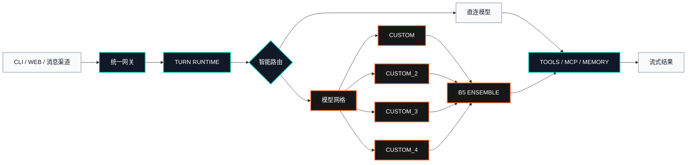

<!-- 本文件与 README.md 的 OpenStarry Code 品牌及核心流程保持同步。 -->

<p align="center">
  <strong><code>OPENSTARRY // CONTROL PLANE</code></strong>
</p>

<h1 align="center">OpenStarry Code</h1>

<p align="center">
  <strong>面向终端、Web 与消息渠道的可叠加多模型智能运行时。</strong><br>
  一个微内核，四个自定义 API 槽位，自动识别模型，组成可编排的模型网格。
</p>

<p align="center">
  <a href="https://github.com/tomysh1337/openstarry-code/actions/workflows/ci.yml"></a>
  <a href="https://www.python.org/downloads/"></a>
  
  
  <a href="LICENSE"></a>
</p>

<p align="center">
  <a href="README.md">English</a> · <b>中文</b> · <a href="README.ja.md">日本語</a> · <a href="README.fr.md">Français</a> · <a href="README.de.md">Deutsch</a> · <a href="README.es.md">Español</a>
</p>

<p align="center">
  <a href="#系统信号">系统信号</a> ·
  <a href="#运行架构">运行架构</a> ·
  <a href="#快速启动">快速启动</a> ·
  <a href="#自定义-api-网格">API 网格</a> ·
  <a href="#命令面板">命令面板</a> ·
  <a href="#文档导航">文档导航</a>
</p>

---

> [!IMPORTANT]
> **OpenStarry Code** 的维护仓库为
> [`tomysh1337/openstarry-code`](https://github.com/tomysh1337/openstarry-code)。
> 为保持现有生态兼容，Python 包、导入路径、CLI 命令、配置文件以及
> `OPENSQUILLA_*` 环境变量继续使用原有兼容标识。

## 系统信号

| 信号 | 状态 | 控制范围 |
| --- | :---: | --- |
| `CORE.01` | **ONLINE** | Web UI、CLI、自动化与消息渠道共用的 Turn Runtime |
| `MESH.04` | **READY** | 四个相互独立的 OpenAI 兼容自定义 API 槽位 |
| `SCAN./MODELS` | **AUTO** | 自动识别端点模型，保留手动模型 ID 回退 |
| `ROUTE.B5` | **ACTIVE** | 多模型提议、审查与聚合执行 |
| `MEMORY.VEC` | **LOCAL** | 持久会话、本地嵌入与向量检索 |
| `TOOLS.MCP` | **NATIVE** | 按需技能、MCP 客户端工具及 MCP 服务端模式 |

OpenStarry Code 让所有入口使用同一条执行链。无论任务来自控制台、终端还是消息渠道，
工具调度、重试策略、会话状态、成本统计和模型决策均保持一致。

## 运行架构



### 运行时档案

```text
PROJECT      OPENSTARRY-CODE
RUNTIME      PYTHON 3.12+ / STARLETTE ASGI
CONTROL      VUE WEB CONSOLE / CLI / CHANNEL ADAPTERS
PROVIDERS    OPENAI / ANTHROPIC / OPENROUTER / OLLAMA / GEMINI / 20+
CUSTOM BUS   CUSTOM + CUSTOM_2 + CUSTOM_3 + CUSTOM_4
STRATEGY     DIRECT / ROUTER / ENSEMBLE
STATE        SQLITE + VECTOR MEMORY + DURABLE SESSIONS
```

## 核心能力

| 层级 | 能力 |
| --- | --- |
| **提供商总线** | OpenAI、Anthropic、OpenRouter、Ollama、DeepSeek、Gemini、Qwen/DashScope、TokenRhythm 等 20 多个提供商档案 |
| **自定义 API 网格** | 四套独立的 Base URL、密钥、默认模型、代理和模型目录 |
| **模型智能** | 自动请求 `/models`、上下文元数据、本地路由和动态 Ensemble 选择 |
| **Agent 运行时** | 持久会话、自适应提示、重试、结构化工具、定时任务和成本统计 |
| **知识层** | 本地嵌入、向量记忆、文件处理、网络搜索和持久化产物 |
| **交互入口** | 内嵌 Web UI、终端聊天、单次自动化、WebSocket RPC 和桌面壳 |
| **消息渠道** | 飞书、Telegram、钉钉、QQ、企业微信、Slack、Discord 及可选 Matrix |
| **扩展平面** | 内置技能、可安装技能、MCP 客户端以及 `mcp-server` 模式 |

## 快速启动

OpenStarry Code 的 API 叠加与模型识别功能位于当前仓库，因此推荐从源码开发模式启动。
源码构建需要 Python 3.12+、Node.js 22.12+（含 npm）、Git LFS 和 `uv`。

### 环境要求

| 组件 | 最低版本 |
| --- | --- |
| Python | 3.12+ |
| Node.js | 22.12+，包含 npm |
| Git | Git + Git LFS |
| Python 环境 | `uv` |

```sh
git lfs install
git clone https://github.com/tomysh1337/openstarry-code.git
cd openstarry-code
git lfs pull --include="src/opensquilla/squilla_router/models/**"

cd opensquilla-webui
npm ci
npm run build
cd ..

uv sync --extra recommended --extra dev
uv run opensquilla onboard
uv run opensquilla gateway run
```

控制台地址：
[`http://127.0.0.1:18791/control/`](http://127.0.0.1:18791/control/)。
启动终端聊天：`uv run opensquilla chat`。

<details>
<summary><strong>各平台环境安装命令</strong></summary>

**Windows PowerShell**

```powershell
winget install --id Git.Git -e
winget install --id GitHub.GitLFS -e
winget install --id OpenJS.NodeJS.LTS -e
powershell -ExecutionPolicy Bypass -c "irm https://astral.sh/uv/install.ps1 | iex"
git lfs install
```

**macOS**

```sh
brew install git git-lfs node uv
git lfs install
```

**Debian / Ubuntu**

```sh
sudo apt update && sudo apt install -y git git-lfs curl
curl -fsSL https://deb.nodesource.com/setup_22.x | sudo -E bash -
sudo apt install -y nodejs
curl -LsSf https://astral.sh/uv/install.sh | sh
git lfs install
```

</details>

<details>
<summary><strong>安装为用户级工具</strong></summary>

源码安装器会先构建 Vue 控制台，再把运行时装进独立的用户环境。

```sh
bash scripts/install_source.sh
```

```powershell
powershell -ExecutionPolicy Bypass -File ./scripts/install_source.ps1
```

使用这种方式安装后，直接运行 `opensquilla`，无需添加 `uv run` 前缀。

当前已发布的桌面包和 wheel 来自
[上游发布通道](https://github.com/opensquilla/opensquilla/releases)。
需要本 fork 的自定义 API 功能时，请使用上面的源码流程。

</details>

## 自定义 API 网格

四个 OpenAI 兼容槽位都是独立的一等提供商。

| Provider ID | 默认密钥变量 | 隔离配置 |
| --- | --- | --- |
| `custom` | `CUSTOM_LLM_API_KEY` | Base URL、密钥、模型、代理 |
| `custom_2` | `CUSTOM_LLM_2_API_KEY` | Base URL、密钥、模型、代理 |
| `custom_3` | `CUSTOM_LLM_3_API_KEY` | Base URL、密钥、模型、代理 |
| `custom_4` | `CUSTOM_LLM_4_API_KEY` | Base URL、密钥、模型、代理 |

连接探测成功后，每个槽位都会请求 `GET <base_url>/models`，返回的模型 ID 会自动进入
模型选择器。不提供模型目录的端点仍可通过手动模型 ID 使用。

### 叠加多个 API

```toml
[llm]
provider = "custom"
model = "model-a"
base_url = "https://api-a.example/v1"

[llm_profiles.custom_2]
model = "model-b"
base_url = "https://api-b.example/v1"

[llm_profiles.custom_3]
model = "model-c"
base_url = "https://api-c.example/v1"

[llm_profiles.custom_4]
model = "model-d"
base_url = "https://api-d.example/v1"
```

密钥可全部保留在配置文件之外：

```sh
export CUSTOM_LLM_API_KEY="TOKEN_A"
export CUSTOM_LLM_2_API_KEY="TOKEN_B"
export CUSTOM_LLM_3_API_KEY="TOKEN_C"
export CUSTOM_LLM_4_API_KEY="TOKEN_D"
```

### 组成 B5 Ensemble

```toml
[llm_ensemble]
enabled = true
selection_mode = "custom_b5"
min_successful_proposers = 2

[[llm_ensemble.candidates]]
provider = "custom"
model = "model-a"
role = "primary"

[[llm_ensemble.candidates]]
provider = "custom_2"
model = "model-b"
role = "contrast"

[[llm_ensemble.candidates]]
provider = "custom_3"
model = "model-c"
role = "reviewer"

[[llm_ensemble.candidates]]
provider = "custom_4"
model = "model-d"
role = "aggregator"
```

运行时会独立执行各提议模型，应用成功数量和超时规则，再把有效结果交给聚合模型。
模型元数据与选择细节见
[`docs/providers-and-models.md`](docs/providers-and-models.md)和
[`docs/features/LLM-ensemble-design.md`](docs/features/LLM-ensemble-design.md)。

## 命令面板

以下命令按用户级安装编写；在源码开发环境中添加 `uv run` 前缀。

```sh
opensquilla onboard                         # 交互式配置
opensquilla onboard status                  # 配置诊断
opensquilla gateway run                     # 前台网关
opensquilla gateway start --json            # 后台托管网关
opensquilla gateway status                  # 运行状态
opensquilla chat                            # 终端聊天
opensquilla agent -m "你的任务"              # 单次自动化
opensquilla doctor --json                   # 完整就绪检查
opensquilla models list                     # 模型目录
opensquilla providers list                  # 提供商目录
opensquilla mcp-server run                  # MCP 服务端模式
```

配置加载顺序：

```text
OPENSQUILLA_GATEWAY_CONFIG_PATH
  -> ./opensquilla.toml
  -> ~/.opensquilla/config.toml
  -> 内置默认值
```

## 仓库矩阵

| 路径 | 职责 |
| --- | --- |
| `src/opensquilla/` | Python 运行时、提供商、网关、记忆、渠道与工具 |
| `opensquilla-webui/` | Vue 控制台和浏览器测试 |
| `desktop/electron/` | 桌面壳与打包 |
| `docs/` | 运维、提供商、架构和功能契约 |
| `tests/` | 单元、集成、功能和兼容性覆盖 |
| `scripts/` | 源码安装、发布检查和维护工具 |

## 验证

```sh
uv run ruff check src tests
uv run mypy src/opensquilla --show-error-codes
uv run pytest -q

cd opensquilla-webui
npm run typecheck
npm run test:unit
```

## 文档导航

| 入口 | 文档 |
| --- | --- |
| 安装与首次运行 | [`docs/quickstart.md`](docs/quickstart.md) |
| 提供商与模型 | [`docs/providers-and-models.md`](docs/providers-and-models.md) |
| 配置结构 | [`docs/configuration.md`](docs/configuration.md) |
| 网关运维 | [`docs/gateway.md`](docs/gateway.md) |
| CLI 参考 | [`docs/cli.md`](docs/cli.md) |
| Web 控制台 | [`docs/web-ui.md`](docs/web-ui.md) |
| 消息渠道 | [`docs/channels.md`](docs/channels.md) |
| 工具与沙箱 | [`docs/tools-and-sandbox.md`](docs/tools-and-sandbox.md) |
| 产品指南 | [`README.product.md`](README.product.md) |

## 命名与兼容

| 范围 | 名称 |
| --- | --- |
| 仓库 | `openstarry-code` |
| 产品 | **OpenStarry Code** |
| Python 发行包 | `opensquilla` |
| Python 导入路径 | `opensquilla` |
| CLI 可执行命令 | `opensquilla` |
| 默认配置 | `opensquilla.toml` / `~/.opensquilla/config.toml` |

保留这些兼容标识是有意设计：现有环境、自动化脚本和插件可以继续工作，仓库与产品展示名称则
统一为 OpenStarry Code。

## 许可证与来源

项目使用 [Apache License 2.0](LICENSE)。

OpenStarry Code 基于[上游项目](https://github.com/opensquilla/opensquilla)演进；
上游发布产物、版权声明和贡献历史继续保留原始署名。

<p align="center">
  <strong><code>OPENSTARRY // BUILD THE MODEL MESH</code></strong>
</p>
